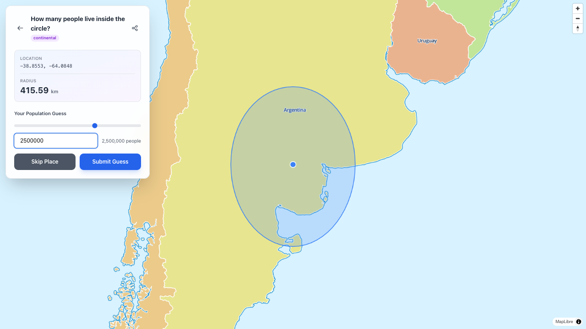

# WorldGuess 🌍

A geographic population guessing game where you estimate the number of people living within randomly generated circles anywhere on Earth.



> [!WARNING]
> This is a proof of concept with no authentication or security measures. The game is easily hackable and should not be used in competitive or production environments.

## Features

- **Multiple Game Modes**:
  - **Regional** (1-10 km): Guess populations of small areas like neighborhoods
  - **Country** (10-100 km): Estimate city and regional populations
  - **Continental** (100-2000 km): Challenge yourself with massive areas

- **Custom Games**: Create your own challenges by choosing location and radius
- **Challenge Mode**: Create multiplayer challenges for IRC channels with webhook integration
- **Real Population Data**: Uses actual population raster data for accurate calculations

## Self Hosting

Everything is self-contained in Docker. Start the full stack with:

```sh
docker compose up
```

The application will be available at `http://localhost:8000`
